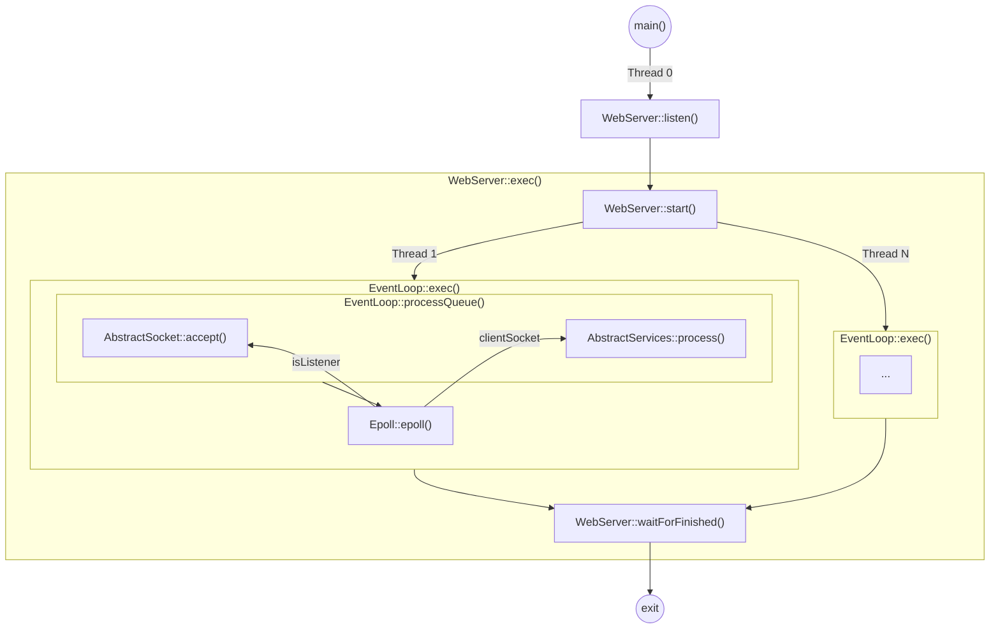
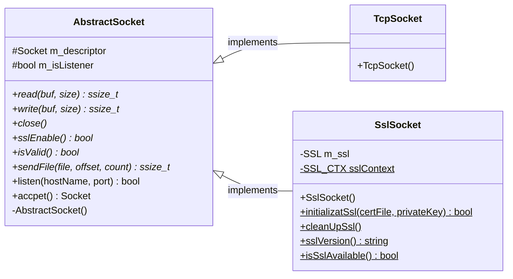
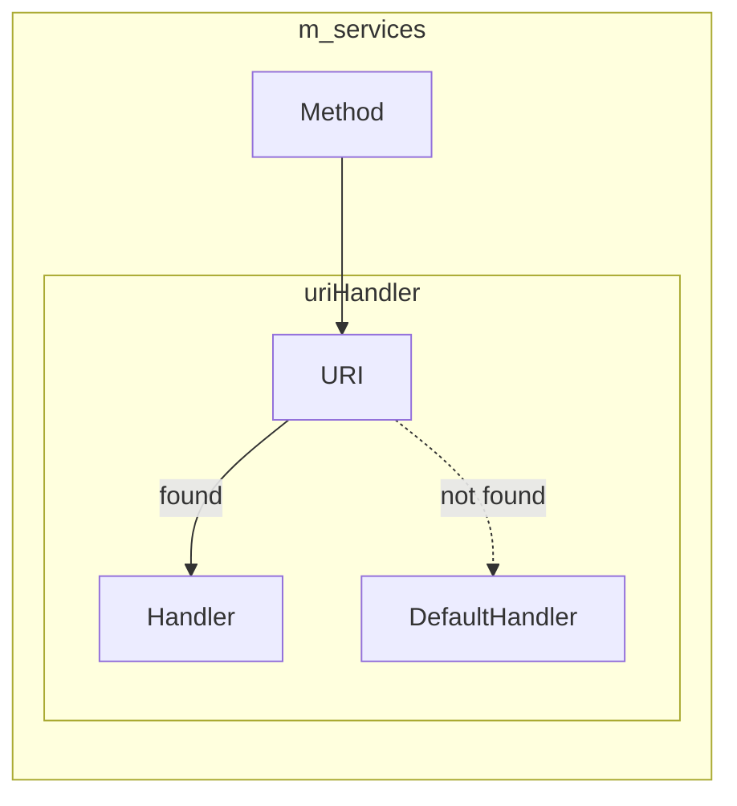

鸽了两年的 blog，我终于回来辣（

这篇 blog 是关于自己胡的一个玩具 HTTP Server。做这个项目的想法来源于 CS:APP 的 TINY Web 服务器实践。（当时感觉挺简单的，现在回头一看全是坑qwq）
<!-- more -->

> 友情提示：此篇 blog 废话较多。作者不是计算机专业的学生，也不从事计算机方面的工作。为节约您的宝贵时间，请酌情观看。

项目地址： <https://github.com/ho-229/Network-Learn>

## 并发模型



先来看看大致的并发模型，其思想是 `one loop per thread`。在 WebServer::start() 中创建了 N 个工作线程和 EventLoop，然后将 listeners 分发到每一个 EventLoop。在 EventLoop::exec() 中循环调用 Epoll::epoll() 等待请求到达，并调用 AbstractServices::process() 处理 I/O 和协议相关的业务。

这种多线程 + [I/O 多路复用](#io-多路复用及跨平台实现) 的并发模型类似于 Nginx（把进程换成了线程）。每个 EventLoop 之间相互独立，所以工作线程之间没有显式的同步代码，也没有切换进程上下文开销。

## Socket 抽象及跨平台实现



AbstractSocket 的两个派生类分别是 TcpSocket 和 SslSocket，分别是 `TCP` 和 `SSL` 链接的跨平台实现。

TcpSocket 的构造函数什么也不做，而 SslSocket 的构造函数会调用 SSL_accept() 完成 `SSL` 握手。

AbstactScoket::read() 和 AbstractSocket::write() 是 `RIO`（自动处理不足值） 跨平台实现的抽象接口。  
TcpSocket 在 Linux 上使用 [read()](https://man7.org/linux/man-pages/man2/read.2.html) 和 [write()](https://man7.org/linux/man-pages/man2/write.2.html)，在 Windows 上使用 [recv()](https://docs.microsoft.com/en-us/windows/win32/api/winsock/nf-winsock-recv) 和 [send()](https://docs.microsoft.com/en-us/windows/win32/api/winsock/nf-winsock-send)；  
SslSocket 使用 [SSL_read()](https://www.openssl.org/docs/man1.1.1/man3/SSL_read.html) 和 [SSL_write()](https://www.openssl.org/docs/man1.1.1/man3/SSL_write.html) 实现。需要注意的是某些 API 的 size 和返回值类型是 int，直接传参可能会导致整数溢出 ~~（屑 Windows 和屑 OpenSSL）~~。

AbstractSocket::sendFile() 是发送文件（Handle 或 file descriptor）的 `RIO` 抽象接口。TcpSocket::sendFile() 在 Linux 上使用 [sendfile64()](https://linux.die.net/man/2/sendfile64)（sendfile64 和其他 I/O 函数一样会返回不足值）；其余平台和 SslSocket 的实现都是 [mmap](https://www.man7.org/linux/man-pages/man2/mmap.2.html) + AbstractSocket::write()。这里会有几个问题：

1. 为什么要用 sendfile64 呢？因为它 ~~（方便，快）~~ 是 Linux 提供的一个在两个文件描述符之间传递数据的“零拷贝”函数（也是 `syscall`）。在最新的实现中，它通过设置 `DMA` 将数据从 `kernel buffer` 直接传输到协议引擎。
2. 为什么 Linux 上的 SslSocket::sendFile() 不能用 sendfile64 实现呢？因为 sendfile64 不支持对数据进行 `SSL` 加密。实际上在 OpenSSL 3.0.0+ 的版本中添加了 [SSL_sendfile()](https://beta.openssl.org/docs/manmaster/man3/SSL_sendfile.html) 这个 API，但是 OpenSSL 3 尚未普及且需要 `kernel TLS/SSL` 支持。
3. 为什么其他的实现要用 mmap + AbstractSocket::write() 而不是 read() + AbstractSocket::write() 呢？主要是因为 mmap 不会改变文件描述符的 seek ，也不会受其影响；其次是 mmap 比 read() 少了一次从 `kernel buffer` 到 `user buffer` 的复制。

AbstractSocket::listen() 是与协议版本无关的监听函数，具体实现可以参考 CS:APP 第三版 P662 的 open_listenfd。  
AbstractSocket::accept() 会非阻塞地返回一个连接描述符（如果没有则返回错误码）。需要注意的是 Windows 的 [accept()](https://docs.microsoft.com/en-us/windows/win32/api/winsock2/nf-winsock2-accept) 返回的套接字会继承 listener 的（非）阻塞状态而 *nix 的 accept() 则不会。所以在 Linux 下需要调用 [accept4()](https://linux.die.net/man/2/accept4) （Linux 的私货）将返回的连接描述符设置为非阻塞，如果是 Unix 系的话就只能在 accept() 之后再调用 fcntl() 将连接套接字设置为非阻塞。

## I/O 多路复用及跨平台实现

为什么要使用 I/O 多路复用呢，一个线程一个 connection 不香么？（doge  
如果你的服务器上有 10000 个链接，这就意味着你需要开 10000 个线程（C10K）。~~众所周知，~~ 大量的线程就意味着大量的线程上下文切换，不仅会浪费大量 CPU 周期，还会浪费内存空间。所以我们需要一个线程能够处理多个 I/O，这就是 I/O 多路复用。

由于这个项目是跨平台项目，然而各个平台优秀的本地接口又各不相同，于是就有了 Epoll 类用来封装跨平台实现。

类 Epoll 主要负责管理 AbstractSocket 的可读和错误（链接断开）事件。Epoll::insert() 和 Epoll::erase() 分别是将套接字添加/移出 Epoll。Epoll::epoll() 负责返回可读套接字和发生错误的套接字。

```cpp
// /TinyWebServer/src/core/epoll.h
class Epoll
{
public:
    explicit Epoll();
    ~Epoll();

    void insert(AbstractSocket *const socket, bool exclusive = false);
    void erase(AbstractSocket *const socket);

    void epoll(std::vector<AbstractSocket *> &events,
               std::vector<AbstractSocket *> &errorEvents);
    // snip
};
```

### Windows（WSAPoll）

由于 [WSAPoll](https://docs.microsoft.com/en-us/windows/win32/api/winsock2/nf-winsock2-wsapoll) 自身并不维护队列，所以我们要自行维护一个 pollfd 线性队列和一个 `fd -> AbstractSocket*` 的 Map（以便用 fd 能找到 AbstractSocket*），然后在 Epoll::insert 和 Epoll::erase 中操作它们（如果可能被异步访问还要给数据结构加锁），最后在 Epoll::epoll 中调用 WSAPoll()。

用 WSAPoll 实现会导致低效的一个原因是当调用 Epoll::erase 的时候需要遍历 pollfd 队列找到要删除的元素，然后把在它之后的元素向前移动一遍，还有一个原因是 WSAPoll 没有办法避免惊群 ㄟ( ▔, ▔ )ㄏ。

### Linux（epoll）

到了 [epoll](https://man7.org/linux/man-pages/man7/epoll.7.html) 就简单了许多，因为它会维护一个红黑树。我们只需要把 AbstractSocket\* 传给 epoll_event::data::ptr，在 Epoll::insert 和 Epoll::erase 中只需要把 epoll_ctl 封装一下，然后在 Epoll::epoll 中调用 epoll_wait。

接下来就是 epoll 高效的秘密了。epoll 的边缘触发（`EPOLLET`）可以让一个事件在新的事件到来之前只触发一次，比起水平触发来说就少了许多冗余事件。还有一个是在 Linux 4.5+ 提供的 `EPOLLEXCLUSIVE`，它能使被监听的套接字只能触发一个 epoll，完美解决了惊群问题。更低版本的 Linux 可以让每个 EventLoop 持有一组 listeners 并设置 `SO_REUSEPORT` 让它们能监听同一组端口。

[关于 Epoll 的碎碎念](#关于-epoll)

### Unix / MacOS / BSD（kqueue）

到了 [kqueue](https://man.openbsd.org/kqueue.2) 事情变得更简单了，因为它只有两个 API！kqueue() 和 kevent()。和 Epoll 一样，kqueue 也会自己维护队列，在 struct kevent 中也同样有存放用户数据结构指针的地方，不同的是 Epoll::insert、Epoll::erase 和 Epoll::epoll 都是 kevent() 的封装。

从接口设计上来说 kqueue 比 epoll 更高效。一次 kqueue 调用不仅可以同时增加/删除多个套接字，还能获取活动事件队列，不过要注意的是，更改的事件只能在下次 kqueue 调用才会生效。kqueue 提供了一个 `EV_CLEAR` 标志用于实现类似于 `EPOLLET` 的语义，它的行为是当事件被用户捕获时清除其状态。至于惊群问题就比较遗憾了，kqueue 没有提供类似 `EPOLLEXCLUSIVE` 的标志，而且在 MacOS 11 上用 `SO_REUSEPORT` 也没办法解决惊群问题。

虽然但是，kqueue 还是提供了强大的 filter，目前为止我们只使用了 kqueue 的一小部分特性。

### 参考资料

* [深入学习理解 IO 多路复用](https://zhuanlan.zhihu.com/p/127148459)
* [epoll在多线程中的应用-EPOLLEXCLUSIVE和REUSEPORT(一)](https://blog.csdn.net/dream0130__/article/details/104009426)
* [Why does one NGINX worker take all the load?](https://blog.cloudflare.com/the-sad-state-of-linux-socket-balancing/)

## EventLoop 及 Timer 实现

### EventLoop

```cpp
// /TinyWebServer/src/core/eventloop.cpp
void EventLoop::exec()
{
    while(m_runnable && m_epoll.count())
    {
        m_epoll.epoll(m_queue, m_errorQueue);

        if(!m_queue.empty())
            this->processQueue();

        if(!m_errorQueue.empty())
            this->processErrorQueue();

        // Clean up timeout connections
        m_manager.checkout(m_errorQueue);

        if(!m_errorQueue.empty())
            this->processTimeoutQueue();
    }
}
```

进入 EventLoop::exec() 后，先用 Epoll::epoll() 获取可读套接字队列和错误/已关闭套接字队列。

在 EventLoop::processQueue() 中会遍历 m_queue（可读套接字队列）。  
如果 AbstractSocket 为 listener，就会循环调用 AbstractSocket::accept() 获取新的客户端的套接字描述符直到返回 INVALID_SOCKET，如果 listener 的 sslEnable() 为真会创建一个 SslSocket 对象，反之会创建 TcpSocket 对象，然后为它设置一个 timer 并调用 Epoll::insert()，最后触发 ConnectEvent::Accept；  
如果 AbstractSocket 为客户端套接字，调用 AbstractServices::process() 处理业务。如果业务处理成功就调用 TimerManager::restart()，如果不成功将会调用 Epoll::erase() 和 TimerManager::destroy()，并触发 ConnectEvent::Close，最后释放套接字内存。

在 EventLoop::processErrorQueue() 中会遍历 m_errorQueue（错误/已关闭套接字队列），如果 AbstractSocket 为 listener 会发出一个 ExceptionEvent::ListenerError，反之会触发 ConnectEvent::Close 并关闭它们。

处理超时链接会调用 TimerManager::checkout() 获取不活跃套接字队列，然后调用 EventLoop::processTimeoutQueue() 关闭它们，流程和 EventLoop::processErrorQueue() 类似但不需要判断是否为 listener，因为 listener 不会被放进 TimerManager 里。

### Timer

```cpp
// /TinyWebServer/src/util/timermanager.h
template <typename T, typename TimeType>
class Timer
{
public:
    explicit Timer(const TimeType& timeout, const T& data);

    inline void reset();

    inline const auto& deadline() const;

    inline const T& userData() const;

    inline bool operator<(const Timer<T, TimeType> &right) const;
    // snip
};

class TimerManager
{
public:
    using TimerItem = Timer<T, TimeType>;
    using iterator = typename std::list<TimerItem>::iterator;

    explicit TimerManager() {}

    iterator start(const TimeType& timeout, const T& data);

    void restart(iterator timerIt);

    void destory(iterator it);

    void checkout(std::vector<T>& list);

    bool isEmpty() const;

    T takeFirst();
    // snip
};
```

在 TimerManager 中会维护一个 Timer 队列（按 deadline 从低到高）。用 std::list 实现的原因是因为它的 insert 和 erase 是常量时间开销且迭代器不会失效，而且它还提供了 [std::list::splice()](https://en.cppreference.com/w/cpp/container/list/splice) 可以在迭代器不失效的前提下移动位置。

调用 TimerManager::start() 时会根据 timeout 创建一个 Timer 插入到队列中并返回它的迭代器。这个迭代器会被保存在 AbstractSocket 里。当 AbstractSocket 触发错误事件时可以通过 AbstractSocket::timer() 找到它的 timer 并用 TimerManager::destory() 删除它。

TimerManager::restart() 会调用给定 Timer 的 Timer::reset() 重置它的 deadline，并将它在队列中重新排序。

在 TimerManager::checkout() 中会检查队列的第一个 Timer。如果当前时间大于 Timer::deadline() 则视为超时，此时会将 Timer::userData() 加入 list 并 pop。重复上述操作直到第一个 Timer 不再超时或队列为空。

TimerManager::takeFirst() 会返回第一个 Timer 所持有的 userData 并 pop_front。它会在 EventLoop 析构的时候被调用，以释放 AbstractSocket 所占的内存。

## HTTP 实现

在谈 HttpRequest 和 HttpResponse 之前，我们先来聊聊 `HTTP header` 的存储（因为它俩的实现都要用到）。

众所周知，`HTTP header` 是不区分大小写的，如果我们想用 Map 来存储 header（name -> value），要么把查询和储存都转成大/小写，要么做忽略大小写的匹配。这里我选择了第二种处理方式，因为这种方式没有对原数据和查询数据的修改。但是 STL 中并没有这方面的支持。对于 [std::map](https://zh.cppreference.com/w/cpp/container/map)，我们需要自定义 Compare；对于 [std::unordered_map](https://zh.cppreference.com/w/cpp/container/unordered_map)，我们需要自定义 Compare 和 Hasher。

先说 Compare。实际上 std::map 和 std::unordered_map 的 Compare 是不一样的（因为一个是二叉树一个是哈希表），所以 std::map 的 Compare 是比较谁大（或谁小），而 std::unordered_map 的是比较两个值是否相等。虽然 STL 并没有提供忽略大小写比较字符串的 functor，但是在 string.h 中提供了相关函数，也就是说我们只需要做跨平台封装就行了，在 Windows 上是 [_strnicmp()](https://docs.microsoft.com/en-us/cpp/c-runtime-library/reference/strnicmp-wcsnicmp-mbsnicmp-strnicmp-l-wcsnicmp-l-mbsnicmp-l?view=msvc-170)，在 Linux 上是 [strncasecmp()](https://linux.die.net/man/3/strncasecmp)。细心的你一定会发现用的都是带 size 参数的版本，这是因为带边界检查可以避免很多潜在问题，比如说比较的字符串不是以 \0 结尾...

然后就是 Hasher，这里实现是用 Key 的第一个字母的小写作为哈希值（~~至于碰撞嘛，能用就行~~。

### HttpRequest

HttpRequest 主要的功能是解析及保存 `HTTP` 请求。

关于 parser 的细节就不过多介绍了（因为这方面我不在行，而且手写 parser 真的是噩梦），这个 parser 虽然不是用状态机实现的，但是运行起来也近似于状态机。接下来是关于 `URI` 的转义处理，转义标准可以参考 `JavaScript` 的 [decodeURI](https://developer.mozilla.org/zh-CN/docs/Web/JavaScript/Reference/Global_Objects/decodeURI)，这里的实现参考 [libhv/cpputil/hurl.cpp](https://github.com/ithewei/libhv/blob/6cf0ce0eb09caf779d5524c154d2166d9aab7299/cpputil/hurl.cpp)。

关于 HTTP 请求头可以参考 [Http Request](https://developer.mozilla.org/zh-CN/docs/Glossary/Request_header)，关于 HTTP parser 的实现可以参考 [nodejs/http-parser](https://github.com/nodejs/http-parser)、[nodejs/llhttp](https://github.com/nodejs/llhttp)。

### HttpResponse

到了 HttpResponse 就简单多了，它只负责生成 `HTTP` 响应头和保存响应体（或响应体的抽象）。

响应体的类型分别有 Text（文本）、Stream（标准流）、File（文件）。原本是打算用 union 实现这个多类型响应体，由于不是类型安全加上成员隐式构造函数的问题于是放弃了。然后把目光投向了 [std::variant](https://en.cppreference.com/w/cpp/utility/variant)，但是 `C++17` 实现的 std::variant 性能不高，也放弃了。最后只好自己用 struct 手撸了一个~~类型安全的~~“联合”。

剩下的就是 HttpResponse::toRawData()。顾名思义，这个函数是将 HttpResponse 转换为完整的 `HTTP` 响应（或响应头部），至于实现就用 std::string::append() 按照标准把响应拼接出来就好啦。

关于 `HTTP` 响应头可以参考 [Http Response](https://developer.mozilla.org/zh-CN/docs/Glossary/Response_header)。

### HttpServices

HttpServices 是 AbstractServices 的派生类，负责保存不同的业务 handler。在 HttpServices::process() 中会调用业务 handler 和处理 `HTTP` 业务的相关逻辑。

首先是业务 handler 的存储。这里用的是两个 Map 嵌套的方式：



---
在 HttpServices::process() 中首先会调用 AbstractSocket::read() 接收请求并调用 HttpRequest::parse() 解析请求，接着调用 HttpServices::callHandler() 调用业务处理代码，然后调用 HttpResponse::toRawData() 转换成 `HTTP` 响应，最后调用 AbstractSocket::write()、AbstractSocket::sendStream()、AbstractSocket::sendFile() 发送响应头和响应体。

## 其他

### 关于 Epoll

关于 Epoll 的好处~~人尽皆知~~，难道它就没有问题吗？当然不是。  

如果把 AbstractSocket\* 放进 epoll_event::data::ptr 里，乍一看很优雅，不用外部维护一个 Map 映射 fd 和 AbstractSocket 了。当 close epoll fd 的时候 epoll_event::data::ptr 指向的内存并不会自动释放，而且我们不能遍历 epoll 内部维护的二叉树释放内存，因此造成内存泄漏。所以必须要存在外部的 holder（在这个项目中是 TimerManager） 控制 AbstractSocket 的生命周期（kqueue 亦是如此）。

其次，epoll_ctl 是 `syscall` 且一次只能处理一个描述符。这就意味着当 epoll 面对大量短链接的时候需要频繁陷入内核，浪费大量的 CPU 周期，导致性能下降（kevent 的设计就避免了这个问题）。

关于 Epoll 设计缺陷更完整的讨论可以看：

* [盘点LinuxEpoll那些致命弱点](https://www.eet-china.com/mp/a109016.html)
* [Epoll is fundamentally broken 1/2](https://idea.popcount.org/2017-02-20-epoll-is-fundamentally-broken-12/)
* [Epoll is fundamentally broken 2/2](https://idea.popcount.org/2017-03-20-epoll-is-fundamentally-broken-22/)
* [IO完成端口(IOCP)](https://zhuanlan.zhihu.com/p/40096515)

更多的并发模型可以看：[AIO](https://zhuanlan.zhihu.com/p/364819119)、[io_uring](https://zhuanlan.zhihu.com/p/62682475)、[Go 并发模型](https://zhuanlan.zhihu.com/p/77206570)。

### 亿些教训

#### glibc malloc()

既然用的是 C++ 就肯定少不了喜闻乐见的内存安全问题。当你遇到下面的报错会怎么办呢：

> malloc(): unaligned tcache chunk detected

经过一番查找和询问，初步判断是 out of range 或 use after free。

原因大概知道了，那么如何定位呢？最开始是用 GDB 定位，结果每次都定位到 STL 的一些 construction 里面。我百思不得其解，然后挂上了 [asan](https://zhuanlan.zhihu.com/p/360135083)，结果还是令人失望，打印了几行信息之后就没反应了，后面上了 Valgrind 也是一样（毕竟是 asan 的亲爹，当然也可能是我的操作有问题qwq）。进度就这样被搁置了一个星期，我甚至开始想停掉这个项目了，因为一个不能稳定运行的 Server 没有任何意义。最后还是决定去 commit history 碰碰运气（因为之前是没问题的）。

结果还真找到了，在这个 [commit](https://github.com/ho-229/Network-Learn/commit/7deee7416aa817bbe1bea502b4c400891b28856b) 中我忽略了 Timer 被释放之后 AbstractSocket 依旧持有它的指针的问题，导致了 use after free，真的是血的教训...

从 commit history 找 bug 算是一个比较通用的手段，如果你也遇到了类似的难题不妨试试这个方法。关于 tcache 我的了解不多，下面是一些参考资料：

* [从 VNCTF2021-ff 浅析 libc2.32 下 ptmalloc 新增的防护之指针异或加密](https://zhuanlan.zhihu.com/p/365170777)
* [glibc tcache 机制](https://firmianay.gitbooks.io/ctf-all-in-one/content/doc/4.15_vsyscall_vdso.html)
* [tcache - CTF wiki](https://ctf-wiki.org/en/pwn/linux/user-mode/heap/ptmalloc2/implementation/tcache/)

#### std::future

你以为到这就完了吗，我在早期还踩过一个大坑，这个坑是关于 [std::future](https://zh.cppreference.com/w/cpp/thread/future) 的。

当时是为了实现 `keep alive`。实现是在一个循环里调用 accept()，然后调用 [std::async()](https://zh.cppreference.com/w/cpp/thread/async) 创建线程处理新链接的所有 `HTTP` 业务。结果是浏览器并不会复用这个链接反而是关闭它发起一个新链接。最后在求助我师傅 [@NiceBlueChai](https://github.com/NiceBlueChai) 的时候，他在 `HTTP` 业务里输出线程 ID 马上发现了问题：**我只创建了一个线程！而且创建线程和调用 accept 的循环被 std::future 的析构函数阻塞了！** 我做梦也想不到 std::future 析构函数会阻塞。当浏览器发起第二个链接的时候会 Pending（因为服务器的 accept 不会被执行），然后它会主动断开第一个链接并重连。

在做这个项目的时候踩过的坑远不止一点点，比如说前面提到的 Windows 和 *nix 的 accept 行为不一致...

## EOF

嘛，最后祝大家 Debug 一帆风顺，能够专心做自己想做的事情。
